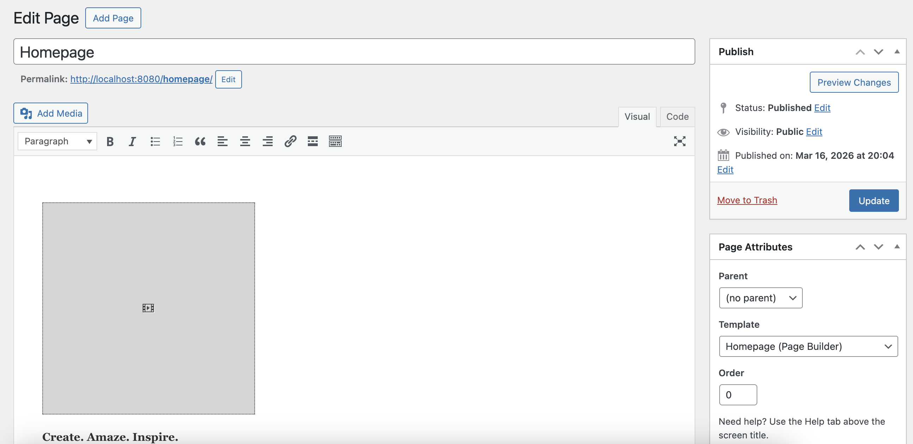
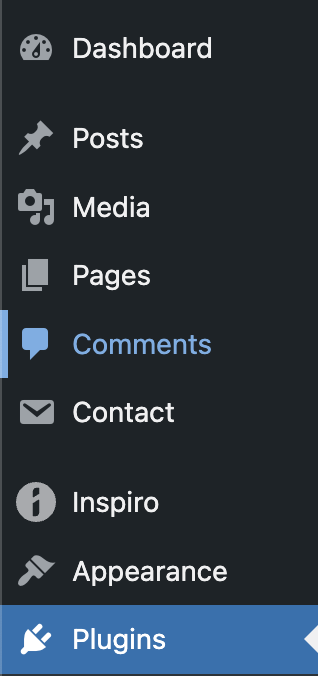
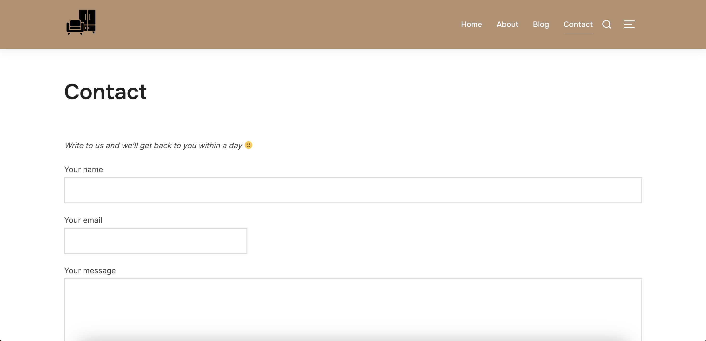
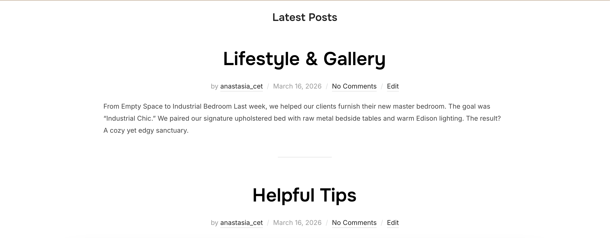
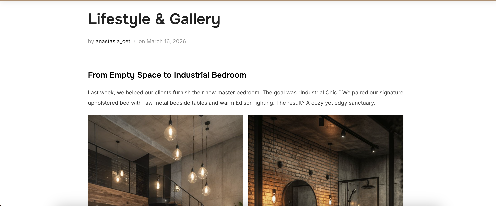

# Laboratory Work №2  

## Introduction to WordPress

---

## 🎯 Purpose of the Work
Learn how to install **WordPress** in a local environment, explore the **admin panel**, change the website appearance using **themes**, and extend functionality using **plugins**.

---

# 📋 Tasks

---

## #1 Working with Themes

1. Opened **Appearance → Themes** in the WordPress dashboard.  
2. Installed a new theme from the official catalog (**Inspiro**).  
3. Activated the theme and compared how the website appearance has changed.

### Theme Customization

Went to **Appearance → Customize** and configured the following:

- **Site logo**
- **Color scheme**
- **Site title and description**

## #2 Working with Plugins

1. Went to **Plugins → Add New** in the WordPress dashboard.  
2. Installed and activated the following plugins:
   - **Classic Editor** 
   - **Contact Form 7** 
3. Checked the new features in the admin panel:
   - Created a new post using **Classic Editor**.

   

   - Created a contact form using **Contact Form 7**.

   

4. Went to **Plugins → Installed Plugins**, deactivated one of the plugins, and verified that its functionality is no longer available.

- For example, if the **Contact Form 7** plugin is deactivated, the **Contact** menu tab disappears from the admin panel and it is no longer possible to manage or create contact forms.

## #3 Creating Content

1. Created a simple page called **"Contacts"** and inserted a contact form on it (using **Contact Form 7**).  

2. Create several blog posts with different types of content, such as:
   - Text

   

   - Images

   

## Control Questions

1. **What does a theme do in WordPress, and what does a plugin do?**  
   - A **theme** controls the visual appearance and layout of the website.  
   - A **plugin** adds extra functionality or features to the website, such as contact forms, SEO tools, or custom editors.

2. **Why doesn’t site content get lost when changing the theme?**  
   - The content (posts, pages, images) is stored in the **WordPress database**, separate from the theme files. Changing the theme only affects the appearance, not the stored content.

3. **How can you change the website appearance without editing code?**  
   - Use the **Customize** section under **Appearance → Customize** to adjust the site logo, colors, fonts, header, and other visual elements.  
   - Install and configure **themes** and **plugins** that provide additional styling options.

## Useful link

- [CMS - WordPress_Introduction](https://github.com/MSU-Courses/content-management-systems/tree/main/02_WordPress_Introduction)

