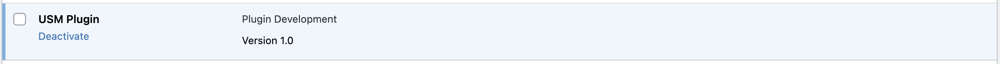
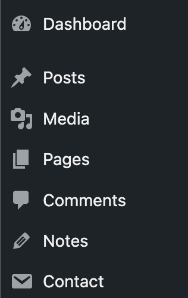
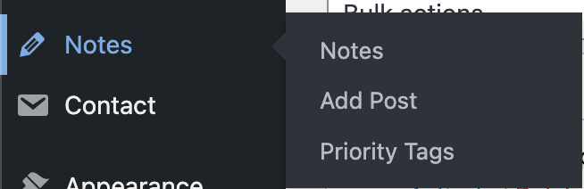
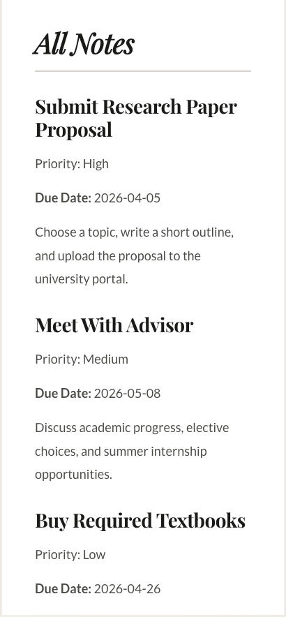
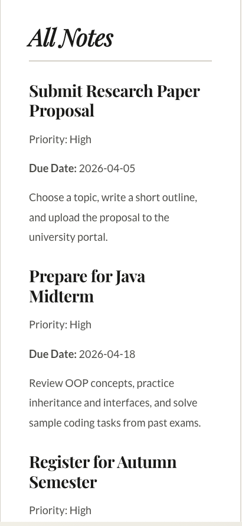
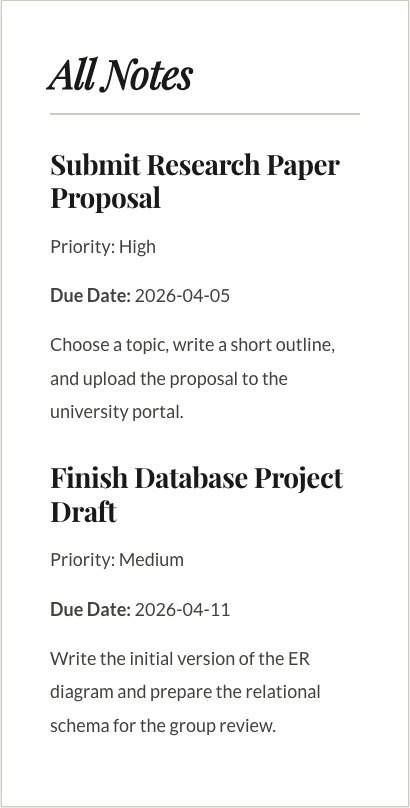

# Laboratory Work №4

## Creating a Custom WordPress Plugin 

---

## Purpose of the Work 
Learn how WordPress stores data: create a custom post type, a custom category, add extra fields in the admin panel, and make a widget to show the data on the site.

---
 
## Overview
 
**USM Notes** is a WordPress plugin that adds a **Notes** section to the site. Each note has:
 
- A **title** and content (via the standard WordPress editor)
- A **Priority** taxonomy (High / Medium / Low)
- A **Due Date** meta field (with validation — date cannot be in the past)
 
Notes can be displayed on any page using the `[usm_notes]` shortcode with optional filters.
 
---

## Steps Completed

### Step 1 – Environment Setup
 
1. Navigate to `wp-content/plugins/` in your local WordPress installation.
2. Create the directory `usm-notes/`.
3. Enable debug mode in `wp-config.php`:
 
```php
define('WP_DEBUG', true);
define('WP_DEBUG_LOG', true);
```
 
---

### Step 2 – Main Plugin File
 
Create `usm-notes/usm-notes.php` with the plugin header:
 
```php
<?php
/**
 * Plugin Name: USM Plugin
 * Description: Plugin Development
 * Version: 1.0
 */
 
```
 
Activate the plugin via **Dashboard → Plugins → Activate**.
 


---

### Step 3 – Custom Post Type (CPT)
 
Registered with `register_post_type()` on the `init` hook.

```php
function usm_register_note_post_type()
    {
        $labels = array(
            'name'               => 'Notes',
            'singular_name'      => 'Note',
        );

        $args = array(
            'labels'             => $labels,
            'public'             => true,
            'has_archive'        => true,
            'menu_icon'          => 'dashicons-edit',
            'supports'           => array('title', 'editor', 'author', 'thumbnail'),
        );

        register_post_type('note', $args);
    }
```



---
 
### Step 4 – Custom Taxonomy
 
Registered with `register_taxonomy()` on the `init` hook and linked to `usm_note`.

```php
function usm_register_priority_tag_taxonomy()
    {
        $labels = array(
            'name'              => 'Priority Tags',
            'singular_name'     => 'Priority Tag',
        );

        $args = array(
            'labels'            => $labels,
            'show_admin_column' => true,
            'rewrite'           => array('slug' => 'priority-tag'),
            'hierarchical'      => true,
        );

        register_taxonomy('priority_tag', 'note', $args);
    }
```



---

### Step 5 – Meta Box (Due Date)
 
#### 5.1 Register the Meta Box

```php
function usm_add_note_meta_box()
    {
        add_meta_box(
            'usm_note_due_date',
            __('Due Date', 'usm-plugin'),
            [$this, 'usm_render_note_due_date_meta_box'],
            'note',
            'side',
            'default'
        );
    }
```

#### 5.2 Render the Meta Box

```php
function usm_render_note_due_date_meta_box($post)
    {
        $due_date = get_post_meta($post->ID, 'note_due_date', true);

        wp_nonce_field('usm_save_note_meta', 'usm_note_meta_nonce');

        echo '<label for="note_due_date">Due Date:</label>';
        echo '<input type="date" id="note_due_date" name="note_due_date" value="' . esc_attr($due_date) . '" />';
    }
```

### Step 6 – Shortcode
 
#### Usage
 
```
[usm_notes]
[usm_notes priority="high"]
[usm_notes before_date="2025-04-30"]
[usm_notes priority="high" before_date="2025-04-30"]
```

#### Registration
 
```php
add_shortcode('usm_notes', [$this, 'usm_notes_shortcode']);
```

#### Handler

```php
public function usm_notes_shortcode($atts)
    {
        $atts = shortcode_atts(array(
            'priority'    => '',
            'before_date' => '',
        ), $atts);

        // Base query arguments
        $args = array(
            'post_type'      => 'note',
            'post_status'    => 'publish',
            'tax_query'      => array(),
            'meta_query'     => array(),
        );

        if (!empty($atts['priority'])) {
            $args['tax_query'][] = array(
                'taxonomy' => 'priority_tag',
                'field'    => 'slug',
                'terms'    => $atts['priority'],
            );
        }

        if (!empty($atts['before_date'])) {
            $args['meta_query'][] = array(
                'key'     => 'note_due_date',
                'value'   => $atts['before_date'],
                'compare' => '<=',
                'type'    => 'DATE',
            );
        }

        $query = new WP_Query($args);

        ...
```

### Step 7 – Testing

#### Test Page — *All Notes*
 
Create a page and insert the following shortcodes:
 
```
[usm_notes]
```



```
[usm_notes priority="high"]
```




```
[usm_notes before_date="2025-04-30"]
```



---
 
## Control Questions

### 1. How does a custom taxonomy differ from a meta field?

A taxonomy is a way to group posts (categories, tags), with the ability to filter and create archive pages.
A meta field is additional information about a post, unique to each post, without a separate page.

Use a **taxonomy** when the same value is shared by many posts and you want archive/filter pages. Use a **meta field** when the value is unique to each post (like a date or number).

### 2. Why is a nonce required when saving meta fields?

A nonce is used to protect the saving of meta fields from forged requests (CSRF).

If not verified:

- Anyone could send a POST request and change the data.
- There is a risk of hacking or tampering with meta data.

### 3. Which `register_post_type()` / `register_taxonomy()` arguments matter most for the frontend?

#### `register_post_type()`
 
| Argument      | Frontend effect                                      |
|---------------|------------------------------------------------------|
| `public`      | Must be `true` for posts to appear on the site       |
| `has_archive` | Enables `/notes/` archive listing page               |
| `rewrite`     | Controls the URL slug (`/notes/my-note/`)            |
| `supports`    | Determines which standard fields render in templates |


#### `register_taxonomy()`
 
| Argument       | Frontend effect                                 |
|----------------|-------------------------------------------------|
| `public`       | Required for taxonomy archive pages to exist    |
| `rewrite`      | Controls the URL slug (`/priority/high/`)       |
| `hierarchical` | Affects how terms are rendered in template tags |

## Useful links

- [Plugin Development I](https://github.com/MSU-Courses/content-management-systems/blob/main/10_Plugin_Development_I/readme.md)
- [Plugin Development II](https://github.com/MSU-Courses/content-management-systems/blob/main/11_Plugin_Development_II/readme.md)