# Laboratory Work №5

## Wordpress Security

---

## Purpose of the Work 
Reinforce the key WordPress security practices: proper role and password management, regular updates, basic hardening (wp-config.php protection, file permissions, disabling the file editor), backup routines, activity monitoring, and step-by-step configuration of All In One WP Security & Firewall (AIOS) to enable brute-force protection, basic WAF features, and permission controls.

---

## Steps Completed

### Step 1 - Environment Preparation

1. Enabled debugging in `wp-config.php`:

```php
define('WP_DEBUG', true);
```

### Step 2 - Managing Roles and Passwords

1. Created a test user with the Author role (for later checks).


2. Ensured that every administrator uses a strong password (8+ characters, letters/numbers/symbols).

### Step 3 - Updating Core, Themes, and Plugins

1. Checked for available updates for WordPress core, themes, and plugins.
2. Updated everything to the latest versions.
3. Enabled automatic updates for themes and plugins.
4. Verified that all updates were completed successfully and the site works correctly.

### Step 4 - Basic Hardening

1. Disabled file editing in the admin panel by adding to `wp-config.php`:

```php
    define('DISALLOW_FILE_EDIT', true);
```

2. Set correct file and folder permissions:
    - Folders: 755

    `drwxr-xr-x`
    
    - Files: 644

    `-rw-r--r--`

3. Protected `wp-config.php` by adding to `.htaccess`:

```apache
<Files "wp-config.php">
Require all denied
</Files>
```

### Step 5 - Installing and Initial Setup of All In One WP Security & Firewall (AIOS)

1. Installed and activate the **All In One WP Security & Firewall** plugin.
2. Opened its settings in the admin panel.
3. Configure the following:
    3.1 **User Login:** Enabled `Login Lockdown` with recommended testing values:
    - Max Login Attempts: 5
    - Retry Time Period: 15 minutes
    - Lockout Time: 30 minutes

    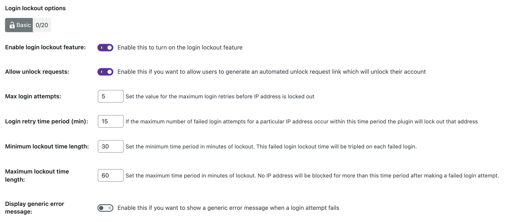

    Enabled `Force Logout` (e.g., 24 hours) to prevent perpetual sessions.
    
    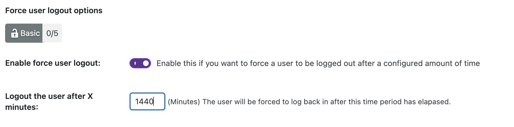

    3.2 **User Accounts:** Checked if a user with login admin exists. If yes — rename it to a secure login via AIOS.

    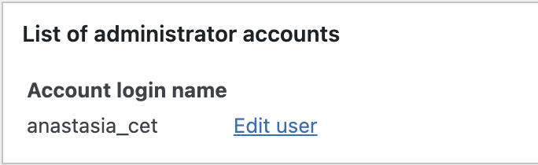

    3.3 **User Registration:** Disabled automatic approval or enable manual approval for new accounts (if registration is open).

    

    3.4 **Filesystem Security:** Run `File Permissions`. Checked and applied recommended fixes (avoid world-writable permissions).

    **Before:**

    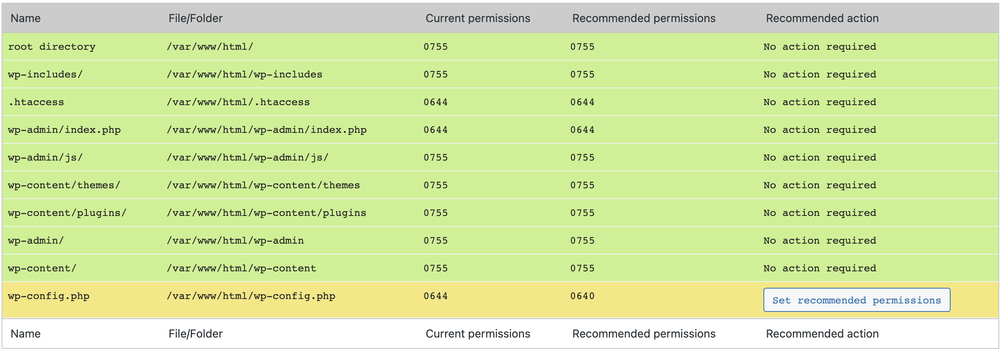

    **After:**

    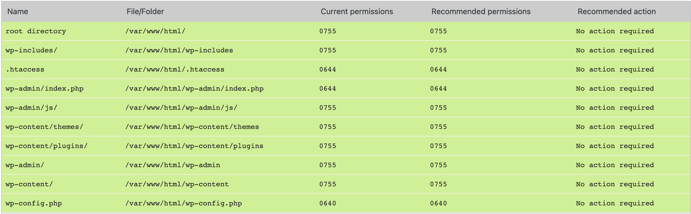

    3.5 **Firewall:** Enabled `Basic Firewall` (start with basic protection).
        
    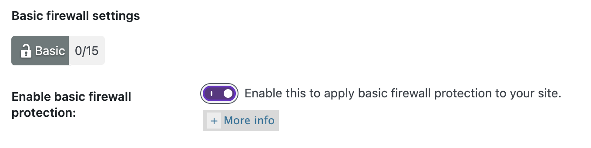

    Enable protection from:
    - Bad Query Strings
    - XSS
    - Directory Browsing

    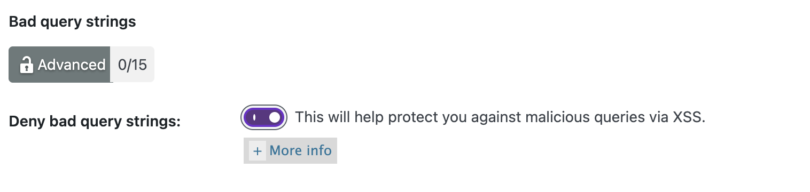

    3.6 **Brute Force:** Enabled `Rename Login Page` (change `/wp-login.php` to something custom like 
    `/login-<slug>`).

    

    3.7 **Scanner / Malware:** Enabled file change detection (notifications sent via email).

    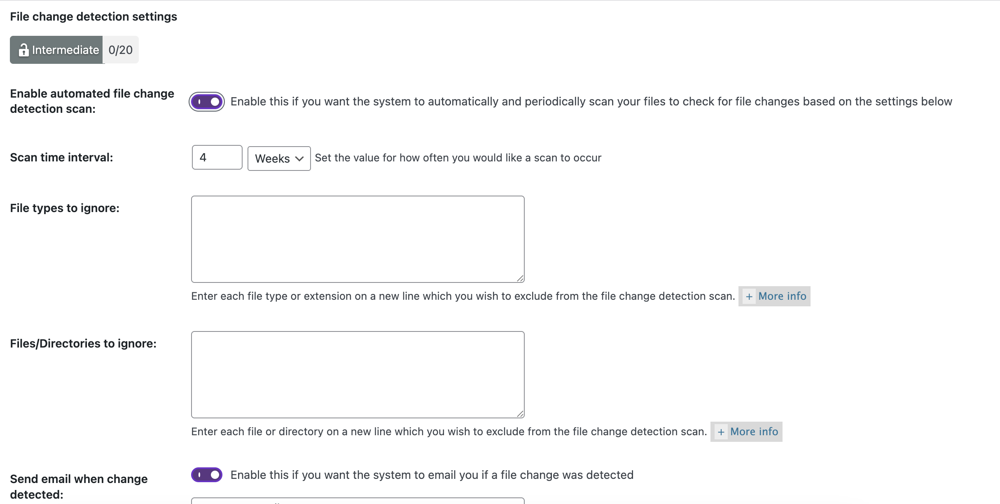

    3.8 **Backup:** In the Database section, created a `database backup` (store it outside the web root). Set a backup schedule if available.

    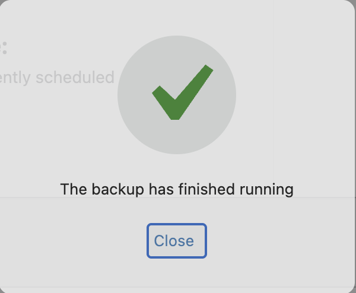

    3.9 **Notifications:** Enabled email notifications for important events (e.g., lockout, new admin, file changes).

### Step 6 - Testing Brute-Force Protection (Using Test User)

1. Loged out.
2. Went to the `new login URL`.
3. Entered an incorrect password 5–6 times.

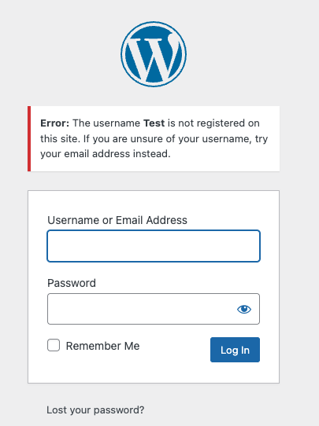

4. Made sure that `Lockdown` triggers (IP or user gets blocked).

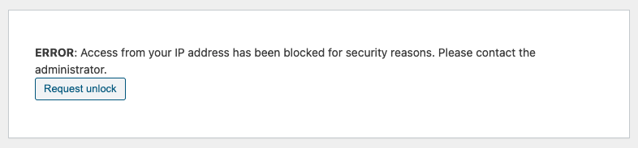


5. Checked the block record in **WP Security → Dashboard / Logs** and unblock the IP if needed.

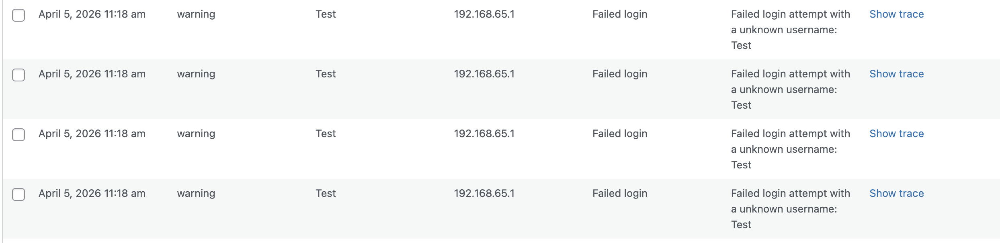

### Step 7 - Restoring From Backup

1. Deleted a test post and one random image.

Created a test post:

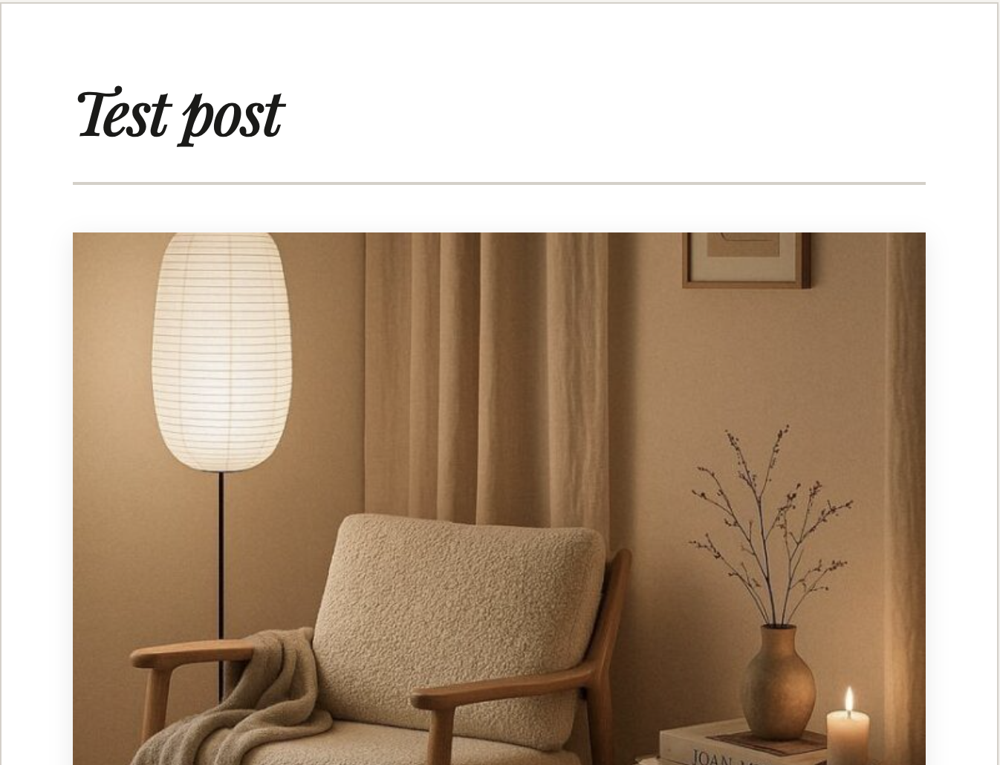

Deleted it:


Post has been deleted:


2. Restored the database from the backup (via SQL import or via the plugin).

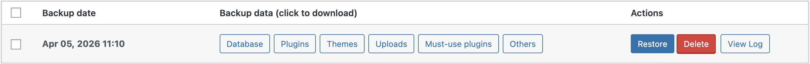

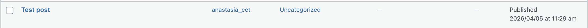

3. Checked data integrity — whether the deleted post and image were restored.


---
 
## Control Questions

1. Why do `DISALLOW_FILE_EDIT` and proper permissions on `wp-config.php` significantly reduce the risk of post-exploitation?

`DISALLOW_FILE_EDIT` removes WordPress’s built-in file editor, so even if an attacker gets into the admin panel, they can’t inject malicious PHP code into theme/plugin files to gain persistence.

Restricting permissions on `wp-config.php` protects the most sensitive file on the site — it prevents attackers (or compromised plugins) from reading database credentials or modifying configuration to plant backdoors.

2. Which `Login Lockdown/Firewall` parameters did you choose and why?

I chose 5 login attempts, a 15-minute retry window, and a 30-minute lockout. This limits brute-force attacks effectively while still giving real users a few chances to correct mistakes. 

3. How do protection measures at the WordPress level (plugin/WAF) differ from measures at the web server and OS level?

`WordPress-level` protection (**plugins/WAF**) works inside the application, so it can block suspicious logins, filter bad requests, enforce roles, detect file changes, and protect WP-specific paths. But it only works after the request reaches WordPress.

`Server- and OS-level` protection works before WordPress is even loaded. This includes firewall rules, file permissions, PHP/Apache/Nginx configuration, and OS security controls.

4. What must be included in a “full” WordPress backup, and how do you verify that restoration actually works?

A full WordPress backup must include the database, which contains:
- posts, pages, users, settings, and plugin data; 
- the WordPress core files; 
- all themes and plugins; 
- uploads and media files; 
- and configuration files like `wp-config.php` and `.htaccess`. 

To verify that restoration works, restore the backup in a test environment and check that all content, media, and settings are intact, key features like login and plugins function correctly, and there are no broken links or missing files.

## Useful links

- [Wordpress_Secutity](https://github.com/MSU-Courses/content-management-systems/blob/main/12_WordPress_Security/readme.md)
